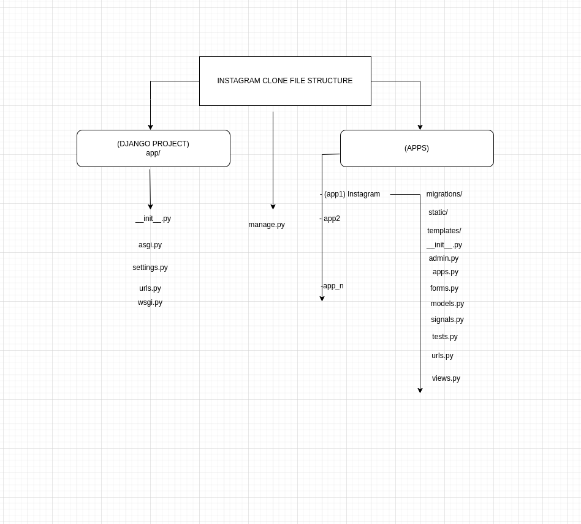
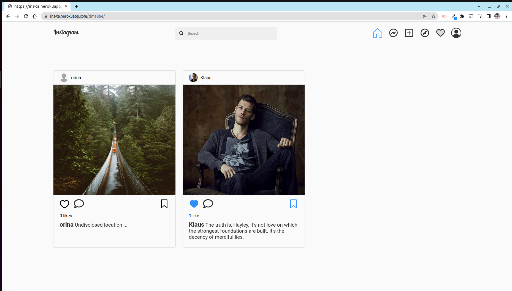
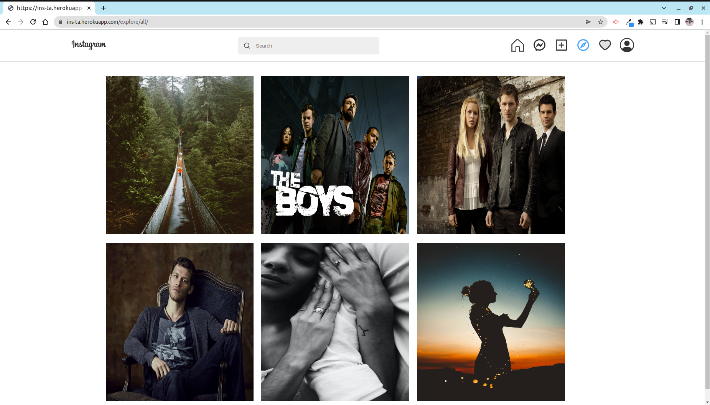
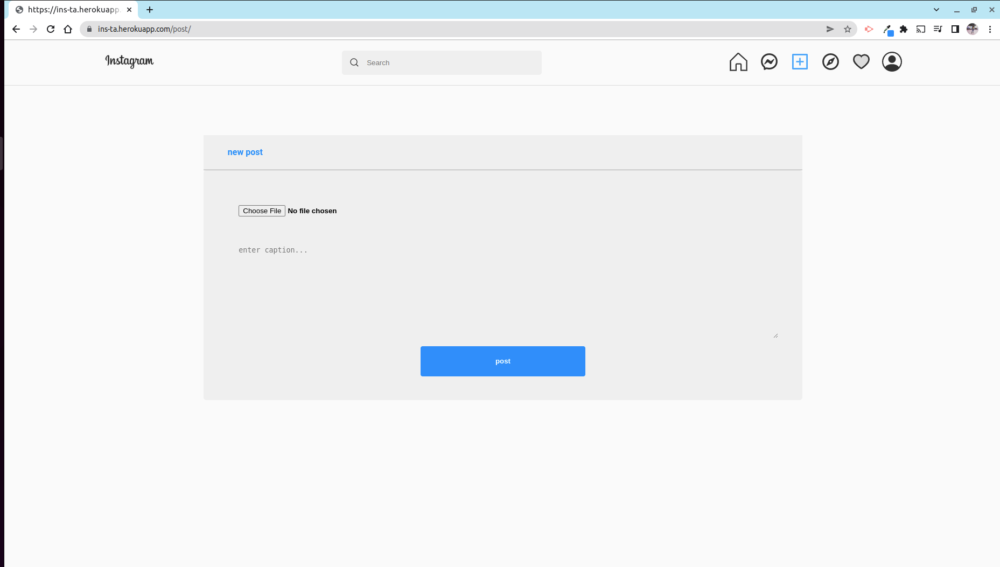
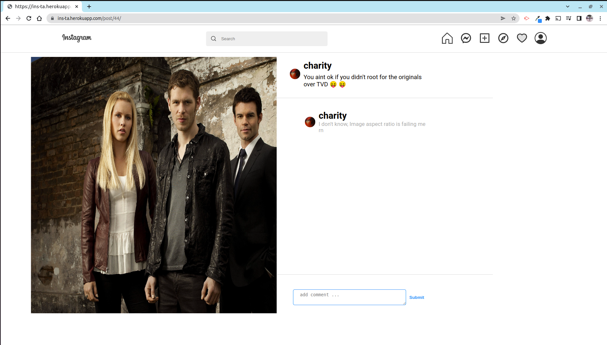
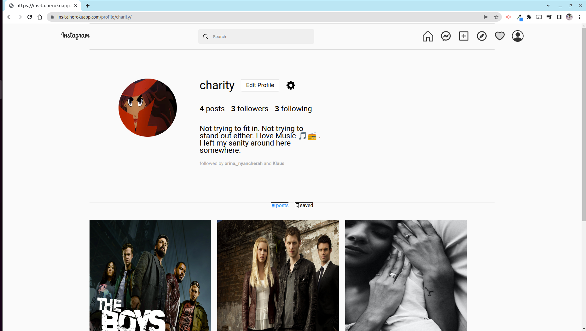
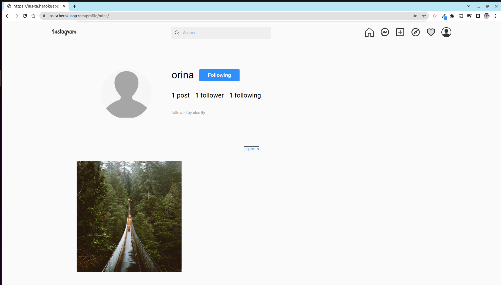

# Instagram-Clone
A website appplication built using python <a href='https://docs.djangoproject.com/en/4.0/'>(DJango)</a> that mimics Instagram to allow users to. <a href='https://ins-ta.herokuapp.com/'>Live site</a>

<ol>
<li> Post Images</li>
<li> Like Images</li>
<li> Save Images to their profiles </li>
<li> Follow and Unfollow other users </li>
<li> View posts by users have those of users they have followed be displayed in their timelines </li>
<li> Comment on any post </li>
<li> Search for any user and view their profile </li>
<li> Explore to view posts by all users </li>
<li> Edit their personal profiles </li>
<ol>
<br>

## Table of Content
- [Prequisite](#prequisite)
- [Application Structure](#application-structure)
- [Installation Requirement](#Installation)
- [Technology Used](#technology-used)
- [Demo](#demo)
- [Licence](#licence)
- [Authors Info](#author-Info)


## Prequisite
- In order to be able to run the application you'll need to generate your cloudinary api key. Head over to <a href='https:/cloudinarycom/'>Cloudinary</a> and create an account.

<br>

## Application Structure

The applucation uses Django's MVT (Model-View-Template) architecture which is a software design pattern for developing a web application. 

<strong>Model </strong> - The model is going to act as the interface of your data. It is responsible for maintaining data. It is the logical data structure behind the entire application and is represented by a database (generally relational databases such as MySql, Postgres). <a href='https://docs.djangoproject.com/en/4.0/topics/db/models/'>Django Models</a>

<br>

<strong> View </strong> -  a view is called that interact with model and template, it renders a template <a href='https://docs.djangoproject.com/en/4.0/topics/http/views/'> Django views</a>

<strong> Template </strong> -  A template consists of static parts of the desired HTML output as well as some special syntax describing how dynamic content will be inserted.<a href='https://docs.djangoproject.com/en/4.0/topics/templates/'> Django templates </a>

## File Structure


<br>

## Installation

- You will need to clone the application and create a virtual and install the dependencies from requirements.txt.

<br>


```
$ git clone https://github.com/charity-bit/Instagram-Clone
$ python3 -m venv virtual 
$ pip install -r requirements.txt
$ pip list 
$ source virtual/bin/activate #to activate the virtual enviroment


```

<br>
create a .env file in the root folder to save your configuration variables that are neccessary in order for the apllication to run.

<br>

### inside your .env file

<br>

```
CD_NAME="cloud name app from cloudinary"
CD_API_KEY="api key from cloudinary"
CD_API_SECRET="api secret from cloudinary" 

SECRET_KEY='your secret key'
DEBUG=True
DB_NAME='your db name'
DB_USER='your db user'
DB_PASSWORD='password to the db user'
DB_HOST='127.0.0.1'
MODE='dev'
ALLOWED_HOSTS='127.0.0.1'
DISABLE_COLLECTSTATIC=1

```

- Assuming you already created an application, You can now run the application.

## Run the application using 

```
$ make / $ make serve / python3 manage.py runserver
```
## Run tests

Run test to the models
```
$ make test / python3 manage.py tests
```


## Technology Used

<ul>
<li>
python Django
 </li>
<li>
PSQL 
</li>
<li>
Javascript
</li>
<li>
CSS
</li>
<li>
Ajax and Jquery
</li>
</ul>

<br>

## Demo

<h4> Timeline </h4>



<br>

<h4> Explore </h4>



<br>

<h4> Add Post </h4>



<br>

<h4> Add Comment </h4>



<br>

<h4>User Profiles </h4>



<br>




## Licence

   copyright © Charity 2022 - <a href="#"> MIT </a>

## Authors Info

-LinkedIn - [Charity Nyanchera](https://www.linkedin.com/in/charitynyanchera)

-twitter - [CcNyanchera](https://twitter.com/CcNyanchera)


